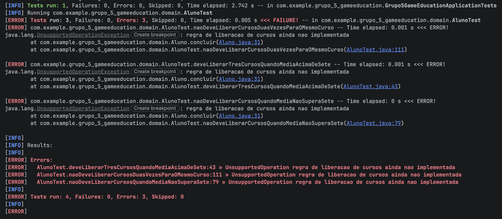
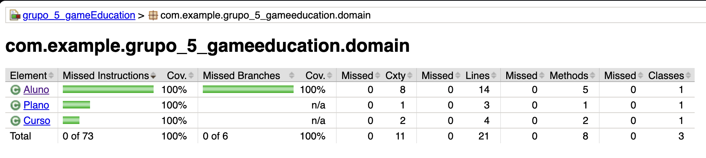
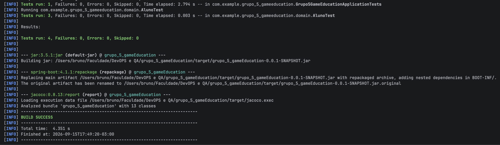
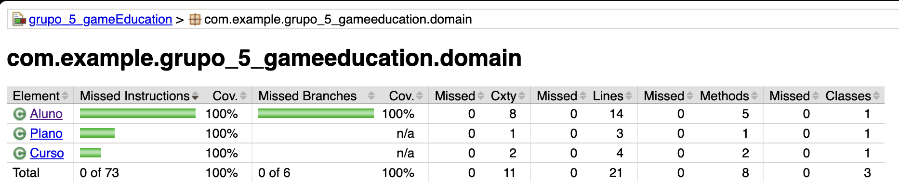
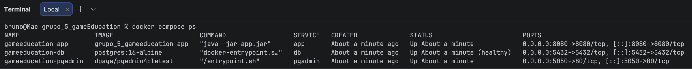

# Gamificação para Engajamento de Educação Continuada

Projeto da disciplina DevOps e QA, Exercício A1: especificação e desenvolvimento de software com ATDD (BDD mais TDD).

A ideia é implementar uma funcionalidade inteira guiada por testes de aceitação. Primeiro a gente escreve a User Story, depois cada integrante deriva um cenário BDD dela, e só então roda o ciclo TDD (RED, GREEN, REFACTOR) em cima da classe de domínio. As outras camadas da aplicação vêm depois, já com a regra de negócio testada.

## Estudo de caso

Uma plataforma vende cursos online e EAD no modelo de assinatura. O aluno paga um valor mensal e tem acesso a um conjunto de cursos na assinatura básica.

* A cada curso terminado com média acima de 7,0, o aluno ganha direito a mais 3 cursos.
* O aluno que mais escreve tópicos no fórum e ajuda colegas com comentários ganha 1 curso no fim do mês.
* Ao conquistar 12 cursos, o plano passa a Premium. O aluno recebe voucher para participar de projetos reais durante os cursos e 3 moedas, que podem virar novos cursos, saldo acumulado ou criptomoeda.

## Integrantes

| Integrante | RA |
|---|---|
| Bruno da Silveira Escanhoela | 236793 |
| Gabriel Ferreira do Nascimento | 236085 |
| João Guilherme Volta Kinol | 235255 |

## Stack

| Camada | Tecnologia |
|---|---|
| Linguagem e build | Java 17, Maven, Spring Boot 4.1.1 |
| Web e API | Spring Web (MVC) |
| Persistência | Spring Data JPA |
| Banco local e de testes | H2 |
| Banco em container | PostgreSQL com pgAdmin |
| Documentação da API | springdoc-openapi (Swagger UI) |
| Testes | JUnit 5 e JaCoCo para cobertura |
| BDD executável (opcional) | Cucumber |
| Front-end | Typescript + React |
| Empacotamento e execução | Docker e Docker Compose |

## 1. User Stories, uma por integrante

A priorização segue engenharia de requisitos: essencial, importante e desejável.

### US1, escrita por Bruno da Silveira Escanhoela. Prioridade: essencial

| EU COMO | PRECISO OU QUERO | PARA |
|---|---|---|
| aluno assinante do plano básico da plataforma de educação continuada | que, ao concluir um curso com média final acima de 7,0, sejam liberados automaticamente 3 novos cursos | continuar minha trilha de aprendizado sem custo adicional e ser recompensado pelo meu desempenho |

### US2, escrita por Gabriel Ferreira do Nascimento. Prioridade: importante

| EU COMO | PRECISO OU QUERO | PARA |
|---|---|---|
| aluno participante do fórum da plataforma | receber 1 curso ao final do mês quando eu for o aluno que mais escreveu tópicos e ajudou colegas com comentários | acessar benefícios exclusivos e converter meu esforço em novos cursos, saldo acumulado ou criptomoeda |

### US3, escrita por João Guilherme Volta Kinol. Prioridade: desejável

| EU COMO | PRECISO OU QUERO | PARA |
|---|---|---|
| aluno assinante que acumulou conquistas | que, ao atingir 12 cursos conquistados, meu plano seja promovido para Premium, com voucher para projetos reais e 3 moedas | obter benefícios exclusivos e converter as moedas em novos cursos, acúmulo ou criptomoeda |

## 2. User Story escolhida: US1 (Bruno)

É o requisito essencial da gamificação. É a regra que gera os cursos conquistados que alimentam a US3 (o contador de 12 cursos) e que dá sentido à recompensa da US2. A regra é objetiva e mensurável (média acima de 7,0 gera 3 cursos), então é totalmente testável e entrega uma funcionalidade válida de ponta a ponta: concluir curso, avaliar média, liberar créditos.

As US2 e US3 dependem, direta ou indiretamente, do contador alimentado por essa regra. Começar por ela destrava as demais e não depende de fechamento mensal nem de ranking de fórum, que são regras com dependência temporal e mais difíceis de automatizar no primeiro ciclo.

### Glossário do domínio

| Termo | O que significa |
|---|---|
| Curso concluído ou conquistado (`cursosConquistados`) | curso que o aluno terminou, registrado via `concluir(curso, media)`. Conta independentemente da média. |
| Curso liberado (`cursosLiberados`) | bônus de 3 cursos creditado a cada curso concluído com média acima de 7,0. |

## 3. Cenários BDD da US1, um por integrante

Formato: Dado que ... (E ...) Quando ... (E ...) Então ... (E ...). A etapa "E" é opcional.

### Cenário 1, escrito por Bruno da Silveira Escanhoela

| Dado que | E | Quando | E | Então | E |
|---|---|---|---|---|---|
| o aluno possui assinatura básica ativa | concluiu o curso "Fundamentos de Agile Testing" | a média final registrada for 8,5 | a conclusão for validada pela plataforma | o sistema deve liberar 3 novos cursos para o aluno | o total de cursos conquistados deve ser 1 |

### Cenário 2, escrito por Gabriel Ferreira do Nascimento

| Dado que | E | Quando | E | Então | E |
|---|---|---|---|---|---|
| o aluno possui assinatura básica ativa | concluiu o curso "Introdução a DevOps" | a média final registrada for menor ou igual a 7,0 (6,5 e 7,0) | a conclusão for validada pela plataforma | nenhum curso adicional deve ser liberado | o aluno permanece com 0 cursos liberados |

### Cenário 3, escrito por João Guilherme Volta Kinol

| Dado que | E | Quando | E | Então | E |
|---|---|---|---|---|---|
| o aluno concluiu o curso "Qualidade de Software" com média 9,0 | já recebeu os 3 cursos referentes a essa conclusão | a conclusão do mesmo curso for registrada novamente | (sem etapa E) | a liberação não deve ocorrer uma segunda vez | o aluno continua com 3 cursos liberados e 1 curso conquistado |

## 4. TDD, um teste para cada cenário BDD

O mesmo teste percorre as três etapas do ciclo. No RED, `Aluno.java` é um stub e os três testes falham. No GREEN, entra a implementação mais simples que faz cada teste passar. No REFACTOR (blue), o código é limpo sem mudar o comportamento e os testes seguem verdes.

Os testes ficam em `src/test/java/com/example/grupo_5_gameeducation/domain/AlunoTest.java`, no padrão AAA (Arrange, Act, Assert). `getCursosConquistados()` devolve o tamanho do conjunto de cursos concluídos.

### Cenário 1, Bruno da Silveira Escanhoela

Teste (RED):

```java
@Test
@DisplayName("Cenario 1 (Bruno): media acima de 7,0 libera 3 novos cursos")
void deveLiberarTresCursosQuandoMediaAcimaDeSete() {
    // ARRANGE
    Aluno aluno = new Aluno("Bruno da Silveira Escanhoela", Plano.BASICO);
    Curso curso = new Curso("Fundamentos de Agile Testing");
    // ACTION
    aluno.concluir(curso, 8.5);
    // ASSERT
    assertEquals(3, aluno.getCursosLiberados());
    assertEquals(1, aluno.getCursosConquistados());
}
```

Implementação mais simples que faz o teste passar (GREEN):

```java
private final Set<String> cursosConcluidos = new HashSet<>();
private int cursosLiberados;

public void concluir(Curso curso, double media) {
    cursosConcluidos.add(curso.getTitulo());
    if (media > 7.0) {
        cursosLiberados += 3;
    }
}
```

Resultado: `getCursosLiberados()` igual a 3 e `getCursosConquistados()` igual a 1. Esperado igual ao obtido, teste verde.

### Cenário 2, Gabriel Ferreira do Nascimento

Teste (RED):

```java
@Test
@DisplayName("Cenario 2 (Gabriel): media menor ou igual a 7,0 nao libera cursos")
void naoDeveLiberarCursosQuandoMediaNaoSuperaSete() {
    // ARRANGE
    Aluno alunoMedia65 = new Aluno("Gabriel Ferreira do Nascimento", Plano.BASICO);
    Aluno alunoMedia70 = new Aluno("Gabriel Ferreira do Nascimento", Plano.BASICO);
    Curso curso = new Curso("Introducao a DevOps");
    // ACTION
    alunoMedia65.concluir(curso, 6.5);
    alunoMedia70.concluir(curso, 7.0);
    // ASSERT
    assertEquals(0, alunoMedia65.getCursosLiberados());
    assertEquals(0, alunoMedia70.getCursosLiberados());
}
```

As duas médias do BDD (6,5 e 7,0) são testadas num único método, para manter a suíte em exatamente 3 testes, um por cenário.

Nenhuma linha nova foi necessária no GREEN. A condição escrita para o cenário 1 já cobre este caso, porque usa "maior que" e não "maior ou igual":

```java
if (media > MEDIA_MINIMA_APROVACAO) {
    cursosLiberados += CURSOS_LIBERADOS_POR_APROVACAO;
}
// medias 6,5 e 7,0 nao entram no if
```

Resultado: `getCursosLiberados()` igual a 0 para as duas médias. Esperado igual ao obtido, teste verde.

### Cenário 3, João Guilherme Volta Kinol

Teste (RED):

```java
@Test
@DisplayName("Cenario 3 (Joao): conclusao repetida do mesmo curso nao bonifica de novo")
void naoDeveLiberarCursosDuasVezesParaOMesmoCurso() {
    // ARRANGE
    Aluno aluno = new Aluno("Joao Guilherme Volta Kinol", Plano.BASICO);
    Curso curso = new Curso("Qualidade de Software");
    // ACTION
    aluno.concluir(curso, 9.0);
    aluno.concluir(curso, 9.0); // deve ser ignorado
    // ASSERT
    assertEquals(3, aluno.getCursosLiberados());
    assertEquals(1, aluno.getCursosConquistados());
}
```

O GREEN deste cenário adiciona a guarda contra conclusão repetida do mesmo curso:

```java
public void concluir(Curso curso, double media) {
    boolean primeiraConclusao = cursosConcluidos.add(curso.getTitulo());
    if (!primeiraConclusao) {
        return;
    }
    if (aprovado(media)) {
        cursosLiberados += CURSOS_LIBERADOS_POR_APROVACAO;
    }
}
```

Resultado: `getCursosLiberados()` igual a 3 e `getCursosConquistados()` igual a 1. Esperado igual ao obtido, teste verde.

### REFACTOR (blue)

Cada cenário tem o seu BLUE, registrado em `Aluno.java`. As refatorações se acumulam de um cenário para o outro, e os três testes continuam passando depois de cada uma.

| Cenário | Motivo (code smell) | Refatoração aplicada |
|---|---|---|
| 1 (Bruno) | Números mágicos (7.0 e 3) espalhados pela lógica | extração de constantes com nome de negócio: `MEDIA_MINIMA_APROVACAO = 7.0` e `CURSOS_LIBERADOS_POR_APROVACAO = 3` |
| 2 (Gabriel) | Condição sem nome, dúvida entre "maior que" e "maior ou igual" | extração de método privado `aprovado(double media)` |
| 3 (João) | Intenção do return antecipado não estava explícita | guard clause contra conclusão repetida, com comentário nomeando a intenção |

`Aluno.java` depois do refactor:

```java
private static final double MEDIA_MINIMA_APROVACAO = 7.0;
private static final int CURSOS_LIBERADOS_POR_APROVACAO = 3;

private final Set<String> cursosConcluidos = new HashSet<>();
private int cursosLiberados;

public void concluir(Curso curso, double media) {
    boolean primeiraConclusao = cursosConcluidos.add(curso.getTitulo());
    if (!primeiraConclusao) {
        return; // ja foi bonificado, ignora
    }
    if (aprovado(media)) {
        cursosLiberados += CURSOS_LIBERADOS_POR_APROVACAO;
    }
}

private boolean aprovado(double media) {
    return media > MEDIA_MINIMA_APROVACAO;
}
```

## 5. Camadas e API

Com a regra provada pelo TDD, o resto da aplicação foi montado em cima dela: `Entity`, `Repository`, `Service`, `DTO` e `Controller`. A `AlunoEntity` (pacote `entity`) espelha a mesma regra da `Aluno` do domínio, mas é a versão persistida em banco (JPA), com id, nome, plano e a lista de cursos concluídos.

| Camada | Classe | Função |
|---|---|---|
| entity | `AlunoEntity` | versão persistida do aluno, com a regra de liberação de cursos |
| repository | `AlunoRepository` | `JpaRepository` do Spring Data |
| service | `AlunoService` | cria aluno, busca, lista e registra conclusão de curso |
| dto | `CriarAlunoRequest`, `ConcluirCursoRequest`, `AlunoResponse` | entrada e saída da API |
| controller | `AlunoController` | endpoints REST, documentados com Swagger |

### Endpoints

| Método | Caminho | O que faz |
|---|---|---|
| POST | `/api/alunos` | cria um aluno |
| GET | `/api/alunos` | lista os alunos |
| GET | `/api/alunos/{id}` | busca um aluno pelo id |
| POST | `/api/alunos/{id}/conclusoes` | registra a conclusão de um curso e aplica a regra da US1 |

A documentação interativa fica em `/swagger-ui.html`.

Testado direto pela API local (perfil padrão, banco H2): criar aluno, concluir "Fundamentos de Agile Testing" com média 8,5 libera 3 cursos e conta 1 conquistado, repetir a mesma conclusão não bonifica de novo, e buscar um aluno inexistente devolve 404.

## 6. Evidências

O `AlunoTest` tem 3 métodos, um por cenário BDD, e o ciclo TDD roda essa mesma suíte contra 3 versões diferentes do `Aluno.java` (RED, GREEN e BLUE). O que muda entre os prints é a implementação, não os testes.

### RED

Testes rodando contra o stub, sem regra implementada.



Resultado: 3 de 3 falham com `UnsupportedOperationException`.

### GREEN

Implementação mais simples que faz os 3 testes passarem.


Resultado: 3 de 3 passam.

Cobertura do GREEN:



A cobertura já ficou em 100% no GREEN, sem amarelo nem vermelho.

### BLUE

Versão final e refatorada.



Resultado: 3 de 3 passam.

Cobertura do BLUE:



Cobertura de 100% em `Aluno`, `Curso` e `Plano`, sem vermelho nem amarelo. O BLUE manteve a cobertura e melhorou a legibilidade do código.

### Docker

Aplicação, PostgreSQL e pgAdmin rodando juntos.


